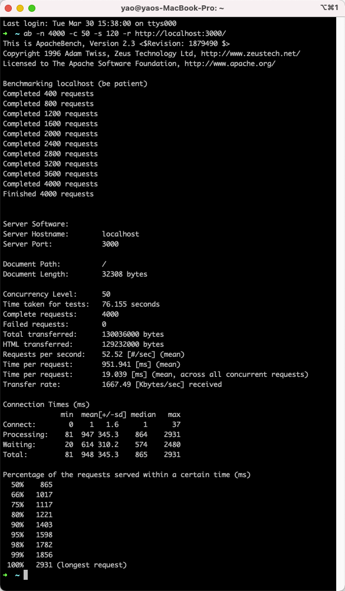
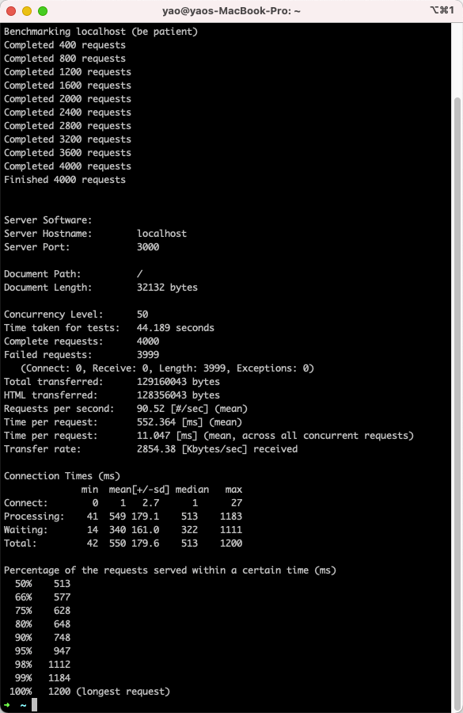

# vue-ssr-element-template

参考文章：
[vivo 商城架构升级-SSR 实战篇](https://juejin.cn/post/6908883342034632712)  
[next-realworld](https://github.com/devJang/nuxt-realworld.git)

## 项目目录说明

```
├── README.md
├── .nuxt                     // Nuxt自动生成，临时的用于编辑的文件，build
├── api
├── assets                    // 用于组织未编译的静态资源如LESS、SASS或JavaScript,对于不需要通过 Webpack 处理的静态 资源文件，可以放置在 static 目录中
│   └── scss
├── commitlint.config.js      // commitlint
├── components                // 用于自己编写的Vue组件，比如日历组件、分页组件
│   ├── business
│   └── common
├── compositions
├── constants
├── jest.config.js
├── layouts                    // 布局目录，用于组织应用的布局组件，不可更改
├── middleware                 // 用于存放中间件
├── nuxt.config.ts             // 用于组织Nuxt.js 应用的个性化配置，以便覆盖默认配置。文件名不可更改。
├── package.json
├── pages                      // 用于组织应用的路由及视图,Nuxt.js根据该目录结构自动生成对应的路由配置，文件名不可更改
├── plugins                    // 用于组织那些需要在 根vue.js应用 实例化之前需要运行的 Javascript 插件。
├── serverMiddleware           
├── static                     // 用于存放应用的静态文件，此类文件不会被 Nuxt.js 调用 Webpack 进行构建编译处理。 服务器启动的时候，该目录下的文件会映射至应用的根路径 / 下。文件夹名不可更改。
├── store                      // 用于组织应用的Vuex 状态管理。文件夹名不可更改。
├── stylelint.config.js
├── test
├── tsconfig.json
├── types
└── utils
```

## 项目配置说明

### vue3

```sh
yarn add @nuxtjs/composition-api
```

nuxt.config.ts 增加配置：

```ts
buildModules: [
  // https://composition-api.nuxtjs.org/getting-started/setup
  '@nuxtjs/composition-api'
],
build: {
    transpile: [/@nuxtjs[\\/]composition-api/],
},
```

jest.config.js 增加配置

```js
moduleNameMapper: {
  '@nuxtjs/composition-api': '@nuxtjs/composition-api/lib/entrypoint.js',
}
```

### element 按需加载

```sh
yarn add babel-plugin-component -D
```

plugins/element-ui.ts

```ts

import Vue from 'vue'
import {
  Button,
  Notification,
  Message,
} from 'element-ui'

Vue.use(Button)

Vue.prototype.$message = Message
Vue.prototype.$notify = Notification
```

nuxt.config.ts 配置

```ts
{
transpile: [/^element-ui/],
babel: {
  plugins: [
    ["component", { "libraryName": "element-ui", "styleLibraryName": "theme-chalk" }]
  ]
},
}
```

## 项目优化

### DNS预解析

如果页面中有其他域名，则可设置预解析

### 缓存

#### 1. 页面缓存

在创建 render 实例时利用 LRU-Cache 来缓存渲染好的 html，当再有请求访问该页面时，直接将缓存中的 html 字符串返回。

```sh
yarn add lru-cache etag
# yarn add @types/lru-cache -D
```

nuxt.config.js 增加配置：

```js
serverMiddleware: ['~/serverMiddleware/pageCache.js']
```

根目录创建 serverMiddleware/pageCache.js

```js
import LRU from 'lru-cache'
import etag from 'etag'

const cacheStore = new LRU({
  max: 1000, // 设置最大缓存数
  maxAge: 1 * 60 * 1000 // 1分分钟
})

export default function(req, res, next) {
  const url = req._parsedOriginalUrl
  const key = url.pathname
  const { etag: curEtag, html } = cacheStore.get(key) || {}
  if (html) {
    res.writeHead(200, { 'Content-type': 'text/html;charset=utf-8' })
    return res.end(html, 'utf-8')
  } else {
    res.original_end = res.end
    res.end = function(data) {
      if (res.statusCode === 200) {
        cacheStore.set(key, { etag: etag(data), value: data }, undefined)
      }
      return res.original_end(data, 'utf-8')
    }
  }
  next()
}
```

#### 2. 组件缓存

将渲染后的组件 DOM 存入缓存，定时刷新，有效期内取缓存中 DOM。主要适用于重复使用的组件，多用于列表，例如商品列表。

配置文件 nuxt.config.js：

```js
const LRU = require('lru-cache')
module.exports = {
  render: {
    bundleRenderer: {
      cache: LRU({
        max: 1000, // 最大的缓存个数
        maxAge: 1000 * 60 * 5 // 缓存5分钟
      })
    }
  }
}
```

缓存组件增加 name 及 serverCacheKey 作为唯一键值：

```js
export default {
  name: 'productList',
  props: ['productId'],
  serverCacheKey: props => props.productId
}
```

#### 3. API 缓存

```sh
yarn add mem
```

```

```

### 接口并发请求

同一个页面，同时调用多个接口，如果是串行调用，需要等待的时间会比较长，如果是并发请求，会缩小等待时间。

例如：

```js
const data1 = await $axios.get('接口1')
const data2 = await $axios.get('接口2')
const data3 = await $axios.get('接口3')
```

可以改成：

```js
const {data1,data2,data3} = await Promise.all([
    $axios.get('接口1')，
    $axios.get('接口2')，
    $axios.get('接口3')
])
```

### 首屏最小化

可以对页面结构进行拆分，首屏元素采用 SSR，非首屏元素通过 CSR；SSR 数据需要通过 asyncData 方法来获取，CSR 数据可以在 mounted 中获取。

CSR 写法如下：

```html
<client-only>
  客户端渲染dom
</client-only>
```

### 部分页面采用 CSR

只对首页、商品详情页等核心页面做 SSR，可以减少服务端的压力。

### 单次访问降级

Nginx 配置如下：

```
  location / {
    proxy_pass Node服务器地址;
    proxy_intercept_errors on;
    error_page 408 500 501 502 503 504 =200 @spa_page;
  }

  location @spa_page {
    rewrite ^/*  /spa/200.html break;
    proxy_pass  静态服务器;
  }
```

### 指定渲染方式

在 url 中增加参数 isCsr=true，Nginx 层对参数 isCsr 进行拦截，如果带上该参数，指向 CSR，否则指向 SSR；这样就可以通过 url 参数配置来进行页面分流，减轻 Node 服务器压力。

### Docker 构建、部署

```sh
# 基础镜像
FROM node:12.16.0

# 创建文件存放目录
RUN mkdir -p /home/docker-demo
WORKDIR /home/docker-demo
COPY . /home/docker-demo

# 安装依赖
RUN yarn install

# 打包，并把静态资源进行md5压缩
RUN yarn prod

# 静态资源部署CDN
RUN yarn deploy

# 端口号
EXPOSE 3000

# 项目启动命令
CMD npm start

```

### 尝试使用命令压测

```sh
ab [option] [http://]host[:port]/path
```

-n 指定压力测试总共访问页面的次数
-c 用于一次产生的请求的并发数
-s 每个响应的最长时间
-r 指定接收到错误信息时不退出程序

```sh
ab -n 4000 -c 50 -s 120 -r http://localhost:3000/
```


